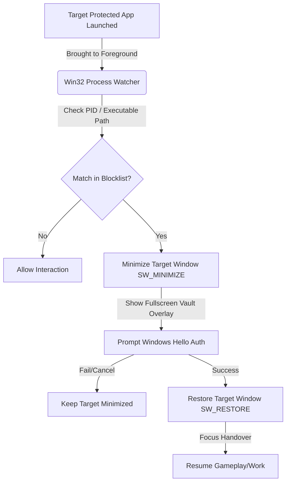

# Windows Hello Vault 🔐🛡️

A lightweight, system-level security utility for Windows that intercepts unauthorized desktop application launches and prompts for authentication using **Windows Hello** (biometrics, fingerprint, facial recognition, or PIN).

Built with **Flutter** for a sleek glassmorphic dashboard and integrated with native **Win32 APIs** via Dart FFI, it locks and minimizes protected applications instantly, keeping your workspace secure.

---

## 🚀 Core Features

- **Biometric Authentication (Windows Hello)**:
  - Supports fingerprint scanning, facial recognition, and local PIN/password authentication via Windows Hello (`local_auth` integration).
- **Process Hooking & Interception**:
  - Dynamically tracks active processes using native Windows API (`GetForegroundWindow`, `GetWindowThreadProcessId`).
  - Fetches target process executable paths securely using `QueryFullProcessImageName` (with limited query rights to prevent permission issues).
  - Instantly minimizes matched target apps (`ShowWindowAsync` with `SW_MINIMIZE`) before users can interact with them.
- **Top-Level Secure Overlay**:
  - Brings the Hello Vault overlay to the front (`SetForegroundWindow`), restricting target app access until biometric verification is complete.
  - Automatically restores the target app window (`SW_RESTORE`) and hands back focus on successful authentication.
- **Strict Protection Policies**:
  - **Auto-Lock on Minimize**: Relocks the vault whenever the window is minimized.
  - **Auto-Lock on Blur**: Relocks when you switch away (focus loss) from the dashboard window.
  - **Start Locked**: Option to launch the vault in a locked state.
- **Native Executable Picker**:
  - Integrates the native Windows Open File dialog (`GetOpenFileName` struct) using custom Dart FFI wrappers, allowing you to pick `.exe` apps directly.
- **Sleek Cyberpunk Dashboard**:
  - Beautiful, dark cyberpunk visual aesthetic with real-time hardware capabilities reporting (biometric compatibility verification).
  - Clean local JSON-based configuration database stored at `%LOCALAPPDATA%\AppLockWin\settings.json`.

---

## 🧠 Architectural Workflow

The application acts as a secure intermediary layer between the OS window manager and protected executables:



1. **The Watcher (Dart Service)**: A periodic ticker (every 900ms) polls the active foreground window handle (`HWND`) using Win32 API.
2. **The Matcher**: Resolves the executable path of the foreground window, normalizes it, and checks it against the user-configured list.
3. **The Interceptor**: If a match is found, the Vault minimizes the target window instantly and pops up a borderless, top-level full-screen auth interface.
4. **The Restorer**: Once Windows Hello confirms your identity, the Vault restores the application window to its original state and yield focus.

---

## 🛠️ Tech Stack

- **Frontend Framework**: Flutter (Desktop Windows)
- **Language**: Dart
- **OS Integration & Bindings**:
  - [`package:win32`](https://pub.dev/packages/win32) for window and process state manipulation.
  - [`package:ffi`](https://pub.dev/packages/ffi) for low-level memory allocation (`calloc`, structures translation).
  - [`package:local_auth`](https://pub.dev/packages/local_auth) for Windows Hello biometrics integration.
- **Local Persistence**: Flat-file JSON store under `%LOCALAPPDATA%\AppLockWin\settings.json`.

---

## 📌 Getting Started

### Prerequisites

To compile or run the application from source:
- Windows 10 or 11
- [Flutter SDK](https://docs.flutter.dev/get-started/install/windows) (Stable channel)
- Visual Studio 2022 (with C++ Desktop development workload)

### Installation & Run

1. Clone the repository:
   ```bash
   git clone https://github.com/SohamVernekar/applock_windows.git
   cd applock_windows
   ```
2. Retrieve packages:
   ```bash
   flutter pub get
   ```
3. Run the development build:
   ```bash
   flutter run -d windows
   ```

### Compile Release Binary

To build a standalone executable:
```bash
flutter build windows --release
```
The compiled artifacts will be created at:
`build\windows\x64\runner\Release\`
